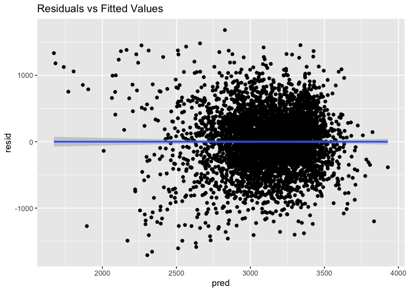
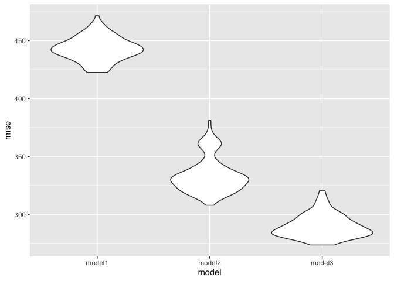

Homework 6 - lvr2115
================
Laura Robles-Torres
2023-11-30

``` r
library(modelr)
library(tidyverse)
library(mgcv)
library(p8105.datasets)

set.seed(1)
```

# Problem 2

``` r
weather_df = 
  rnoaa::meteo_pull_monitors(
    c("USW00094728"),
    var = c("PRCP", "TMIN", "TMAX"), 
    date_min = "2022-01-01",
    date_max = "2022-12-31") |>
  mutate(
    name = recode(id, USW00094728 = "CentralPark_NY"),
    tmin = tmin / 10,
    tmax = tmax / 10) |>
  select(name, id, everything())
```

This code creates a multiple linear regression model with ‘tmax’ as the
response with ‘tmin’ and ‘prcp’ as the predictors.

``` r
fit = lm(tmax ~ tmin + prcp, data = weather_df)

fit |> 
  broom::glance()
```

    ## # A tibble: 1 × 12
    ##   r.squared adj.r.squared sigma statistic   p.value    df logLik   AIC   BIC
    ##       <dbl>         <dbl> <dbl>     <dbl>     <dbl> <dbl>  <dbl> <dbl> <dbl>
    ## 1     0.916         0.915  2.96     1972. 2.19e-195     2  -912. 1832. 1848.
    ## # ℹ 3 more variables: deviance <dbl>, df.residual <int>, nobs <int>

``` r
fit |>
  broom::tidy()
```

    ## # A tibble: 3 × 5
    ##   term        estimate std.error statistic   p.value
    ##   <chr>          <dbl>     <dbl>     <dbl>     <dbl>
    ## 1 (Intercept)  8.04      0.230      35.0   4.39e-118
    ## 2 tmin         1.01      0.0162     62.7   1.43e-196
    ## 3 prcp        -0.00154   0.00210    -0.733 4.64e-  1

## Distribution of R-squared

This code uses 5000 bootstrap samples to plot the *distribution of
R-squared.*

``` r
#bootstrapping
weather_r2 = 
  weather_df |> 
    modelr::bootstrap(n = 5000, id="strap_number") |> 
    mutate(
     models = map(.x=strap, ~lm(tmax ~ tmin + prcp, data = .x)),
     results = map(.x=models, broom::glance)) |> 
    select(strap_number, results) |>
    unnest(results) 

#plot
weather_r2 |> 
  ggplot(aes(x = r.squared)) + geom_density()
```

<!-- -->

``` r
#confidence intervals
weather_r2|>
  summarize(
    ci_lower = quantile(r.squared, 0.025), 
    ci_upper = quantile(r.squared, 0.975))
```

    ## # A tibble: 1 × 2
    ##   ci_lower ci_upper
    ##      <dbl>    <dbl>
    ## 1    0.889    0.941

The graph shows a left-skewed distribution of R-squared with the curve
peaking at around 0.920 in a graph ranging from 0.850 to 0.950. The 95%
confidence interval is (0.889, 0.941).

## Distribution of log of beta1\*beta2

This code uses 5000 bootstrap samples to plot the *distribution of
log(beta 1 times beta2).*

``` r
#bootstrapping

weather_log =
  weather_df |> 
    modelr::bootstrap(n = 5000, id="strap_number") |> 
     mutate(
      models = map(.x=strap, ~lm(tmax ~ tmin + prcp, data = .x)),
      results = map(models, broom::tidy))|>
    select(strap_number, results)|>
    unnest(results) |> 
    pivot_wider(
      names_from = term, 
      values_from = estimate) |>
    group_by(strap_number) |>
    summarize(
     tmin = first(na.omit(tmin)),
     prcp = first(na.omit(prcp)),
     log_product = log(tmin * prcp)
    )

#plot
weather_log |>
  filter(log_product!="NaN") |>
  ggplot(aes(x=log_product))+geom_density()
```

<!-- -->

``` r
#confidence intervals 
ci_log_product =
  weather_log |> 
  summarize(
    ci_lower = quantile(log_product, 0.025, na.rm=TRUE),
    ci_upper = quantile(log_product, 0.975,na.rm=TRUE)
  )
```

The distribution of log(tmin\*prcp) is also remarkably left-skewed with
the curve peaking at around -5.5 on a graph of range -13 to -4. The 95%
confidence interval is (-8.947,-4.571).

# Problem 3

``` r
birthweight = 
  read_csv("./birthweight.csv") |>
  janitor::clean_names(case="snake") |>
  drop_na() |>
  filter(malform!=1) |>
  mutate(
    id = row_number(),
    babysex = as.factor(babysex),
    frace = as.factor(frace),
    malform = as.factor(malform),
    mrace = as.factor(mrace))
```

## Proposing a model

I propose that the predictors that could affect bw and should be in my
model are: gestational age at birth (gaweeks), mother’s pre-pregnancy
BMI (ppbmi), maternal race (mrace) and average number of cigarettes
smoked per day during pregnancy (smoken). This model is based on the
factors I know from working in the MCH field previously are most likely
to have an effect on bw. I removed observations in my dataset in which
there is a malformation that could affect birthweight present, as there
are only 15 observations in which there is a malformation and I would
consider them outliers in this case as malformations are not a predictor
of interest.

``` r
model1 =lm(bwt~gaweeks+ppbmi+mrace+smoken, data=birthweight)
model2= lm(bwt~blength+gaweeks, data = birthweight)
model3= lm(bwt~bhead*blength + bhead*babysex + blength*babysex, data=birthweight)

summary(model1)
```

    ## 
    ## Call:
    ## lm(formula = bwt ~ gaweeks + ppbmi + mrace + smoken, data = birthweight)
    ## 
    ## Residuals:
    ##      Min       1Q   Median       3Q      Max 
    ## -1708.26  -271.40    -1.07   279.79  1680.39 
    ## 
    ## Coefficients:
    ##              Estimate Std. Error t value Pr(>|t|)    
    ## (Intercept)  617.8929    97.3351   6.348 2.40e-10 ***
    ## gaweeks       59.1629     2.1785  27.158  < 2e-16 ***
    ## ppbmi         16.2743     2.1239   7.663 2.24e-14 ***
    ## mrace2      -294.1297    14.6546 -20.071  < 2e-16 ***
    ## mrace3      -134.4121    68.4921  -1.962   0.0498 *  
    ## mrace4      -201.2634    30.1601  -6.673 2.82e-11 ***
    ## smoken       -10.9102     0.9407 -11.597  < 2e-16 ***
    ## ---
    ## Signif. codes:  0 '***' 0.001 '**' 0.01 '*' 0.05 '.' 0.1 ' ' 1
    ## 
    ## Residual standard error: 442 on 4320 degrees of freedom
    ## Multiple R-squared:  0.255,  Adjusted R-squared:  0.254 
    ## F-statistic: 246.4 on 6 and 4320 DF,  p-value: < 2.2e-16

``` r
summary(model2)
```

    ## 
    ## Call:
    ## lm(formula = bwt ~ blength + gaweeks, data = birthweight)
    ## 
    ## Residuals:
    ##     Min      1Q  Median      3Q     Max 
    ## -1708.7  -215.6   -10.6   208.7  4189.0 
    ## 
    ## Coefficients:
    ##              Estimate Std. Error t value Pr(>|t|)    
    ## (Intercept) -4337.554     98.156  -44.19   <2e-16 ***
    ## blength       128.559      1.997   64.37   <2e-16 ***
    ## gaweeks        26.780      1.730   15.48   <2e-16 ***
    ## ---
    ## Signif. codes:  0 '***' 0.001 '**' 0.01 '*' 0.05 '.' 0.1 ' ' 1
    ## 
    ## Residual standard error: 333.2 on 4324 degrees of freedom
    ## Multiple R-squared:  0.5762, Adjusted R-squared:  0.576 
    ## F-statistic:  2940 on 2 and 4324 DF,  p-value: < 2.2e-16

``` r
summary(model3)
```

    ## 
    ## Call:
    ## lm(formula = bwt ~ bhead * blength + bhead * babysex + blength * 
    ##     babysex, data = birthweight)
    ## 
    ## Residuals:
    ##      Min       1Q   Median       3Q      Max 
    ## -1134.23  -189.81    -6.27   178.92  2714.47 
    ## 
    ## Coefficients:
    ##                    Estimate Std. Error t value Pr(>|t|)    
    ## (Intercept)      -3754.4041   859.6150  -4.368 1.29e-05 ***
    ## bhead               79.4720    25.9349   3.064  0.00220 ** 
    ## blength             31.2559    17.8261   1.753  0.07961 .  
    ## babysex2           244.3217   197.9644   1.234  0.21721    
    ## bhead:blength        1.5604     0.5267   2.962  0.00307 ** 
    ## bhead:babysex2     -12.3750     7.0564  -1.754  0.07955 .  
    ## blength:babysex2     4.3500     4.1805   1.041  0.29815    
    ## ---
    ## Signif. codes:  0 '***' 0.001 '**' 0.01 '*' 0.05 '.' 0.1 ' ' 1
    ## 
    ## Residual standard error: 287.9 on 4320 degrees of freedom
    ## Multiple R-squared:  0.684,  Adjusted R-squared:  0.6835 
    ## F-statistic:  1558 on 6 and 4320 DF,  p-value: < 2.2e-16

### Plot model residuals vs. fitted values for my proposed model (model 1)

``` r
birthweight |> 
  add_predictions(model1) |>
  add_residuals(model1) |>
  ggplot(aes(x = pred, y = resid)) +  geom_point() +
  geom_smooth(method = "lm") +
  labs(
    title = "Residuals vs Fitted Values ")
```

    ## `geom_smooth()` using formula = 'y ~ x'

<!-- -->

The slope of this line is ~0, as indicated by the fact it appears
horizontal. This indicates a lack of relationship between residuals and
predictors and confirms that we can assume homoscedasticity as the
variance of the residuals is approximately constant across all levels of
the predicted values.\*

## Comparing to other models using CV

``` r
cv_df =
  crossv_mc(birthweight, 100)  #80 cross validation runs

cv_df = 
  cv_df |> 
  mutate(
    model1  = map(.x = train, ~lm(bwt~gaweeks+ppbmi+mrace+smoken, data = .x)),
    model2  = map(.x = train, ~lm(bwt~blength+gaweeks, data = .x)),
    model3  = map(.x = train, ~lm(bwt~bhead*blength + bhead*babysex + blength*babysex, data = .x))) |>
  mutate(
    rmse_model1= map2_dbl(.x=model1, .y=test, ~rmse(model = .x, data = .y)),
    rmse_model2= map2_dbl(.x=model2, .y=test, ~rmse(model = .x, data = .y)),
    rmse_model3 = map2_dbl(.x=model3, .y=test, ~rmse(model = .x, data = .y)) 
  ) 
```

``` r
cv_df |> 
  select(starts_with("rmse")) |> 
  pivot_longer(
    everything(),
    names_to = "model", 
    values_to = "rmse",
    names_prefix = "rmse_") |> 
  mutate(
    model = fct_inorder(model)) |> 
  ggplot(aes(x = model, y = rmse)) + geom_violin()
```

<!-- -->

Based on this graph displaying the RMSE of each model, I would conclude
that model \#3 (interaction term model) has the lowest RMSE. Between
model 2 and model 3, which both have significantly lower RMSE than model
1, I would choose model \#3 as it explains more of the variability in
‘bwt’ based on R-squared values and has a lower RMSE than model 2.
